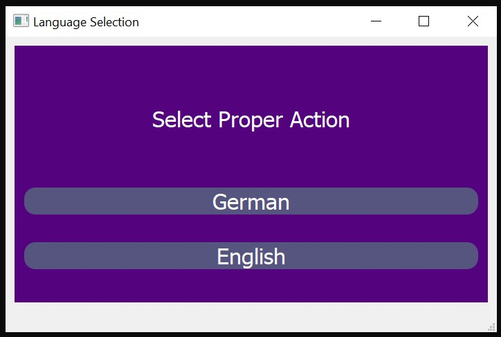
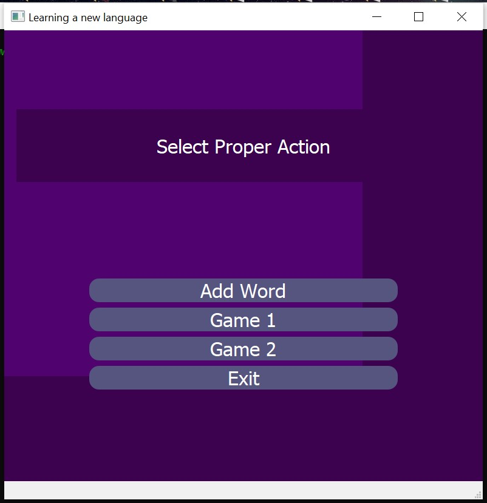
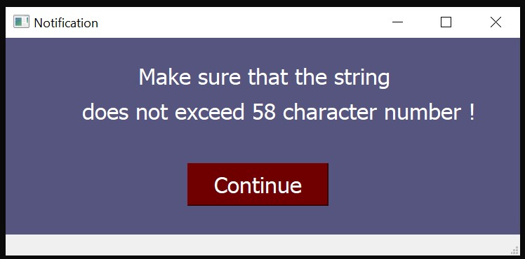
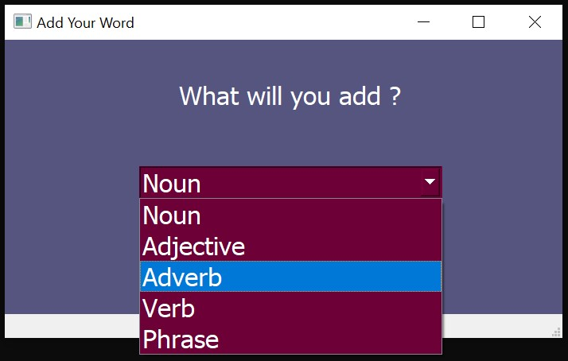
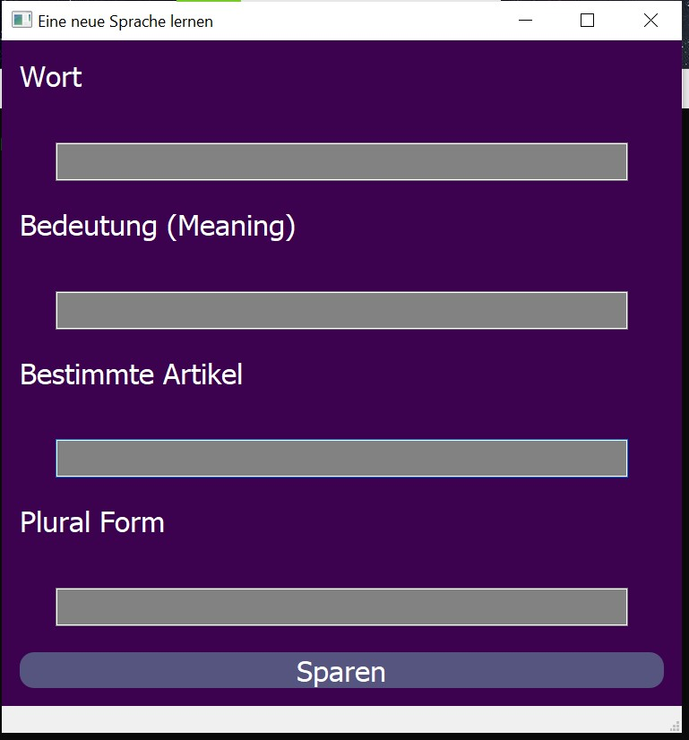
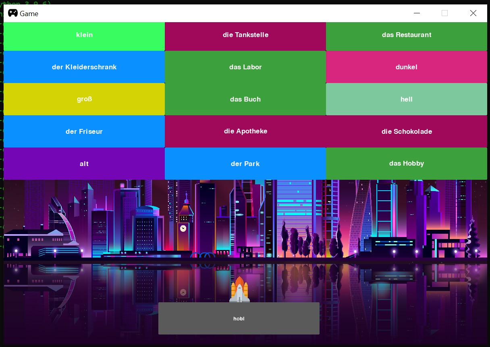
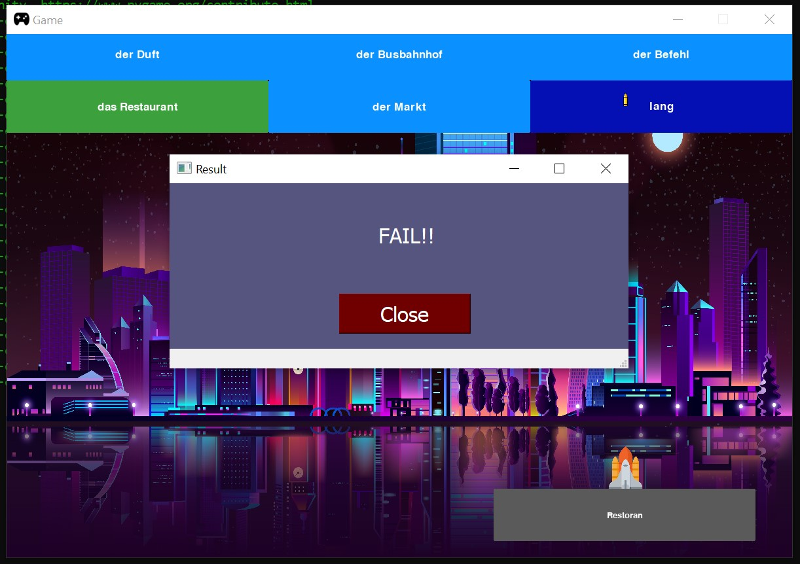
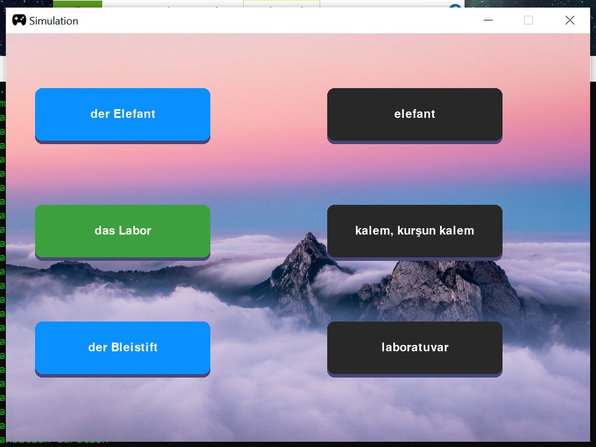
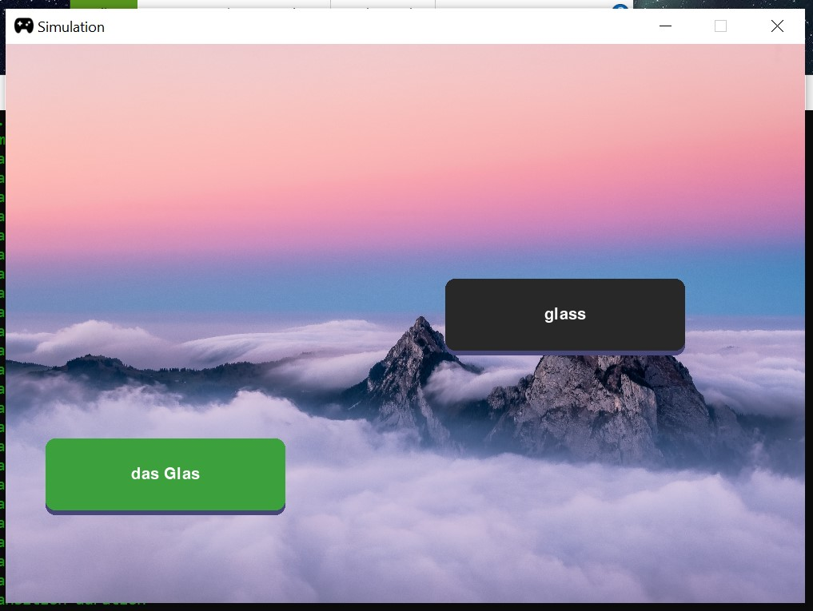
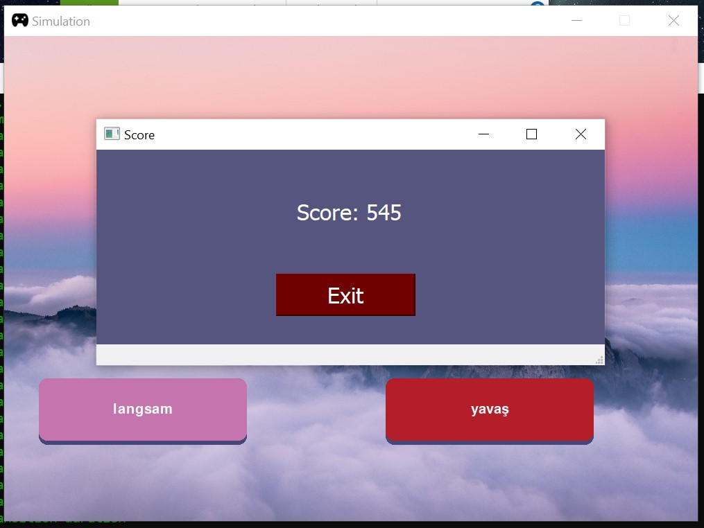

# Language Learning Application

A prototype application for an easy language learning platform.  
 

### Table of Contents
1.  [Landscape](#Landscape)  
2.  [Main Menu](#mainmenu)  
3.  [German Language Platform](#german)  
4.  [Adding a New Word in the Game](#addWord)  
5.  [Game 1](#game_1)  
6.  [Game 2](#game_2)  

### Landscape
My desktop application is a language-learning tool designed to make memorizing German/English vocabulary both intuitive and engaging. By combining cognitive science principles with playful interaction, the app transforms each word into a unique learning experience. Users encounter German words through vivid color associations, mini-games, and interactive simulations—each tailored to reinforce meaning and recall. Whether it's matching a verb to an animation or linking a noun to a themed visual environment, the app turns passive memorization into active exploration, helping learners retain vocabulary more effectively and enjoyably.

### Main Menu

    

<b>Figure 1:</b> Main menu of the game. (This is the initial UI and will be revised later.)

### German Language Platform

    

<b>Figure 2:</b> When the user selects German as the language, a different page is displayed. (This is the initial UI and will be updated later.)

### Adding a New Word in the Game

    

<b>Figure 3:</b> When the user clicks 'Add a new word', a notification appears outlining certain input constraints. (This is the initial UI and will be updated later.)

 

    

<b>Figure 4:</b> Next, the user selects the word type (e.g., noun, adjective, etc.), which determines the following input fields. (This is the initial UI and will be revised later.)

 

    

<b>Figure 5:</b> If the word is a noun, the user will be prompted to enter the following: the word, its meaning, its article, and its plural form. (This is the initial UI and will be updated later.)

### Game 1

    

<b>Figure 6:</b> In the first game, players shoot the correct word that matches the meaning shown below. As the user shoots the correct words, the new words will appear.

 

    

<b>Figure 7:</b> When the user selects the wrong word, a notification appears, and the word is added to the unknown word pool for use in machine learning–based word suggestions.

### Game 2

    

<b>Figure 8:</b> In the second game, three German words are displayed on the left, and their Turkish translations appear on the right in a mixed order.

 

    

<b>Figure 9:</b> The user first selects a German word on the left, then its corresponding Turkish translation on the right. If the match is correct, both words disappear.

 

 

    

<b>Figure 10:</b> At the end of the game, the user receives a score based on their performance.

 
